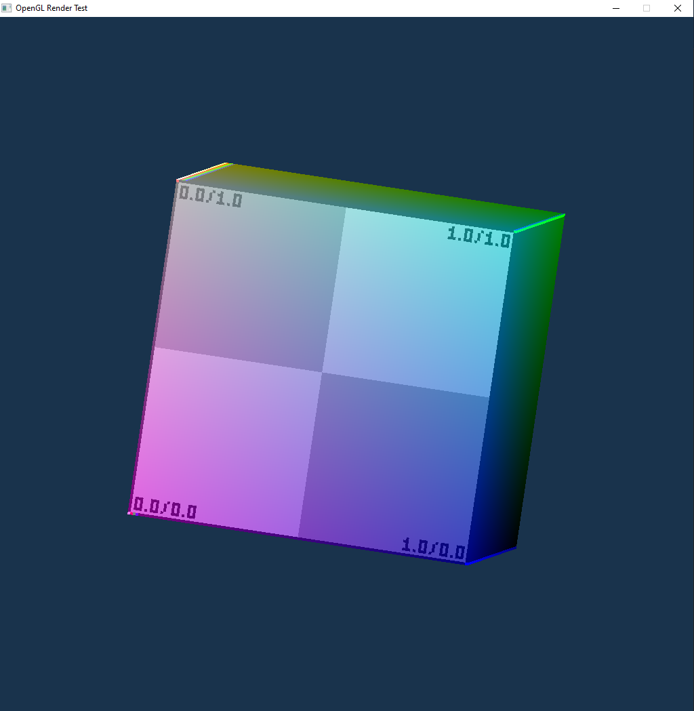

# OpenGL Learning Test Program

I recently decided to try learning about graphics programming and
decided to do it by getting rendering a basic cube with OpenGL.
It was pretty tricky, especially with all the very old tutorials
and documentation online, but eventually I managed to achieve
what I wanted thanks to the very thorough - if a bit dense -
documentation available on the Khronos wiki and other sources.

## How to use it

You can try to build it, but it wasn't really designed to be that
portable, and I imagine would be a pain to actually make. I've
included a built exe, but again, it might not work on your system.
You're not really missing out on much though, just look at the
screenshot above.

If you do manage to run it, though, you'll be greeted by a rotating
cube with a test texture on it. Riveting....

The only interactivity at the moment is to press space to toggle
the rotation.

## Project Structure

It's pretty messy, but I did try to keep some organisation by
putting the majority of the OpenGL boilerplate in a set of
helper files (gl.h / gl.c). These handle things like getting
the OpenGL context set up and working with the SDL window,
loading and compiling the shaders, allocating vertex buffers
and setting the correct vertex attributes, loading textures,
and some handy utils like error checking.

Outside of that, I wanted to learn about shaders, so I have
a few of them in `/shaders` that show my escalating knowledge
from a simple orthographic 2D vertex shader for rendering a
simple 2D quad, all the way up to 3D vertex shaders with
basic rotation, and a fragment shader for blending uv-mapped
textures and vertex colours. It ended up being a lot more
fun (and trouble, lol) than I had expected, and gave me a
much deeper understanding of what's going on under the hood
in most game engines. I only barely managed to restrain myself
from trying to write a whole 3D game engine myself once I
got the basics working, xD